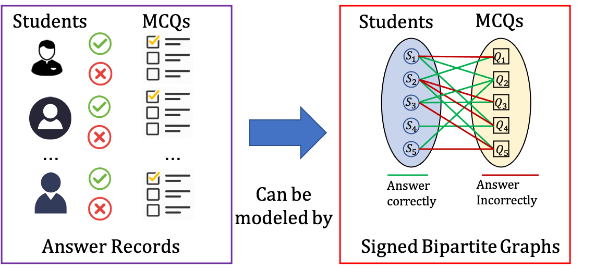

# SBCL: Predicting Student Performance on Learnersourced Multiple-Choice Questions using Signed Graph Neural Networks

## Introduction
The ability to make accurate predictions regarding student performance plays a key role in online learning platforms. It enables the early identification of potential dropouts, supports targeted interventions for at-risk students and is the essential foundation for adaptive learning tools that select optimal learning content to match the current ability of each student. Learnersourcing has recently emerged as one promising technique for the development of large repositories of content suitable for personalised learning. Multiple-choice questions (MCQs) are a very popular format in learnersourcing platforms, and have been shown to be engaging for students. However, accurately predicting student performance on unseen MCQs is a challenging task in such settings. There is often considerable noise present in the data given that items are student-generated and evaluated. In addition, prior work involving graph-based representations tend to model simple neighbour relationships without encoding information about success and failure on individual items. In this paper, we propose a novel approach using Signed Graph Neural Networks (SGNNs) to achieve accurate predictions of student performance on MCQs in learnersourcing platforms. Specifically, we use a signed bipartite graph to model students’ answers where positive and negative edges represent correct and incorrect answers respectively. We further propose a new Signed Bipartite graph Contrastive Learning model, called **SBCL**, to mitigate the impact of noise on model performance. We evaluate the effectiveness of our approach on 5 real-world datasets from PeerWise, a widely-used learnersourcing platform. Our experimental results show that this new approach can achieve more accurate and stable predictions of student performance when compared to other baselines.



## Code Structure
- /datasets 
  - /processed  # edge index 
    - /Biology  # Biology dataset
    - /Cardiff0 # Cardiff dataset
    - /Law      # Law dataset
    - /Sydney   # Sydney0 dataset
    - /Sydney1  # Sydney1 dataset
- /results
- /src 
  - /signed_graph_model
- /utils
  - load_new_data.py    # process raw datasets excluding Biology and Law
  - load_old_data.py    # process raw datasets excluding Biology and Law
  - results.py
- gatcl.py  # SBCL training code with semantic embedding
- gatcl_nlp.py  # SBCL training code with semantic embedding

## Run example
To train the model and get results:
```{bash}
: base model
python gatcl.py --rounds=1 --emb_size=64 --mask_ratio=0.2 --dataset=Sydney1

: NLP variant
python gatcl_nlp.py --rounds=1 --emb_size=64 --lr=1e-2 --nlp_lr=1e-3 --num_layers=2 --mask_ratio=.2 --beta=5e-4 --nlp_method=roberta --dataset=Sydney1
```
> NOTE: The dataset argument must be identical to the name of the dataset folder.
